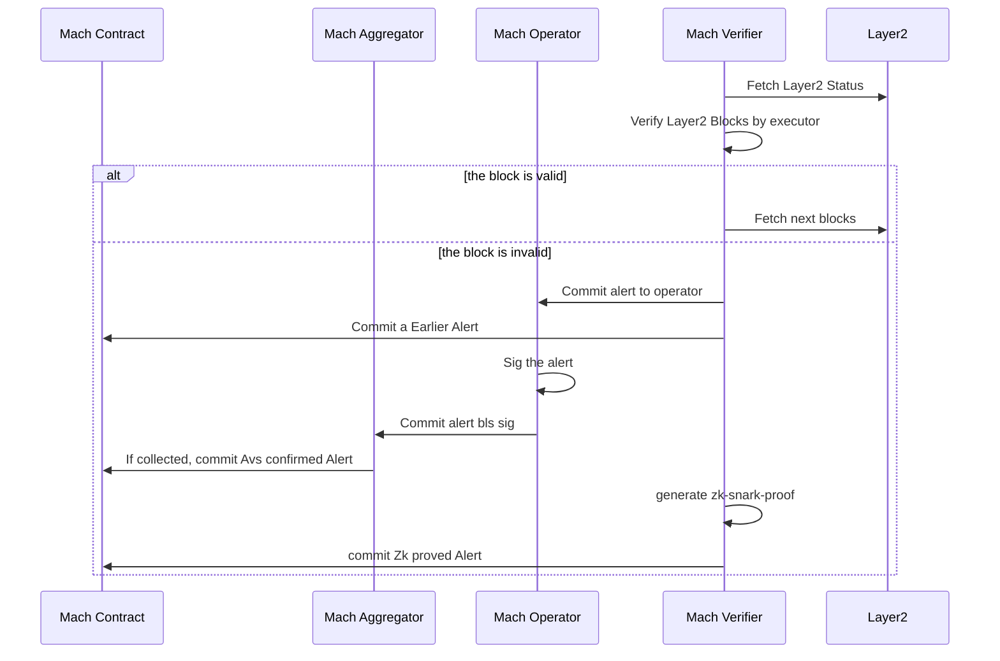
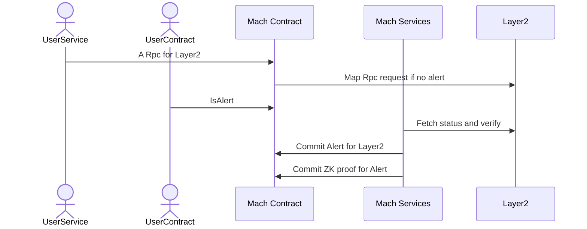

# Mach AVS (M2)

AltLayer Mach AVS is a fast finality layer for Ethereum rollups. In Mach AVS , operators will run verifier nodes for rollups, monitor the rollup for fraudulent behavior, and submit a fraudulent alert to Mach AVS. Fraudulent alert can then be confirmed via sufficient quorum or ZK proofs.

## Use cases

1. Fast finality services for Web3 application
2. Circuit breaker for RPC nodes

## Components

Mach AVS consists of the following component:

- Mach AVS service manager contract
- Mach AVS aggregator (for signature aggregation version)
- Mach AVS operator
- Mach verifier

## Architecture

### BLS Signature Aggregation Mode

.jpg)



### ZK Proof Mode

.jpg)



## Mach AVS service manager contract

Mach AVS service manager contracts can be found in [contracts folder](contracts/src/core/)

- [Mach AVS for all rollup stack (BLS Signature aggregation)](contracts/src/core/MachServiceManager.sol)
- [Mach AVS for OP stack based rollup (ZK proof)](contracts/src/core/MachOptimismZkServiceManager.sol)

### Dependencies

Mach AVS uses [EigenLayer Middleware v0.1.2](https://github.com/Layr-Labs/eigenlayer-middleware/releases/tag/v0.1.2-holesky-init-deployment)

### Alert submission and verification

#### BLS Signature Aggregation Mode

The aggregator service will collect BLS signatures from operators in Mach AVS. Upon reaching sufficient threshold,
the aggregator will `confirmAlert)` to submit the alert. Once verified, the alert will be confirmed.

#### ZK Proof Mode

In this mode, it does not need an aggregator to collect signatures. ZK Proof will replace the process of collecting BLS signature.

Operator can detect block or output root mismatch and submit an alert using `alertBlockMismatch()` and `alertBlockOutputOracleMismatch(`) respectively.
After the alert is submitted, operator will compute the corresponding ZK proof to prove the alert and submit the proof using `submitProve()`. 

ZK Proof generation can be either done using RISC0 or GGPU.

### Training wheels

Mach AVS includes operator allowlist which can be managed by contract owner. 

#### Enable/Disable operator allowlist

- Enable operator allowlist: `enableAllowlist()`
- Diosable operator allowlist: `disableAllowlist()`

#### Operator allowlist management

- Add operator to whitelist: `addToAllowlist(address operator)`
- Remove operator from whitelist: `removeFromAllowlist(address operator)`

## Mach AVS Aggregator (for BLS Signature Mode)

Aggregator sample configuration file can be found at [config-files/aggregator.yaml](config-files/aggregator.yaml).

```bash
./bin/mach-aggregator --config <PATH_TO_CONFIG> \
    --ecdsa-private-key <OWNER_PRIVATE> \
    --avs-deployment ./contracts/script/output/machavs_deploy_output.json
```

The `--avs-deployment` is use the `machavs_deploy_output.json` output by deploy script.

Mach AVS aggregator service can be found in [aggregator](aggregator/)

## Mach AVS Operator (for BLS Signature Aggregation Mode)

Operator sample configuration file can be found at [config-files/operator.yaml](config-files/operator.yaml).

Operator can be run using the following command:

```bash
./bin/mach-operator-signer --config <PATH_TO_CONFIG> 
```

Node operator client can be found in [operator](operator/). For more information on how to run operator, check out our guide at [here](scripts/README.md)

## Mach AVS Verifier

### Verifier for ZK Proof mode

The ZK Proof mode verifier codebase is found at [https://github.com/alt-research/alt-mach-verifier](https://github.com/alt-research/alt-mach-verifier)

### Verifier for BLS Signature Aggregation mode

The verifier codebase is found at [https://github.com/alt-research/mach](https://github.com/alt-research/mach)

## Deployment scripts for running within local devnet

Check out [scripts](scripts)
