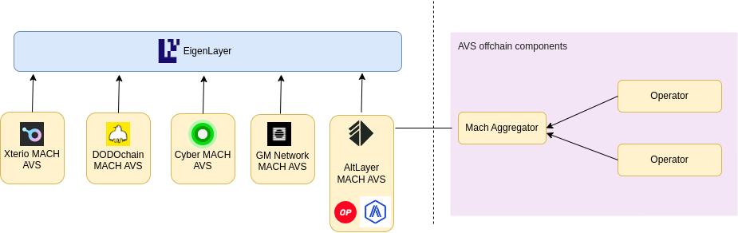
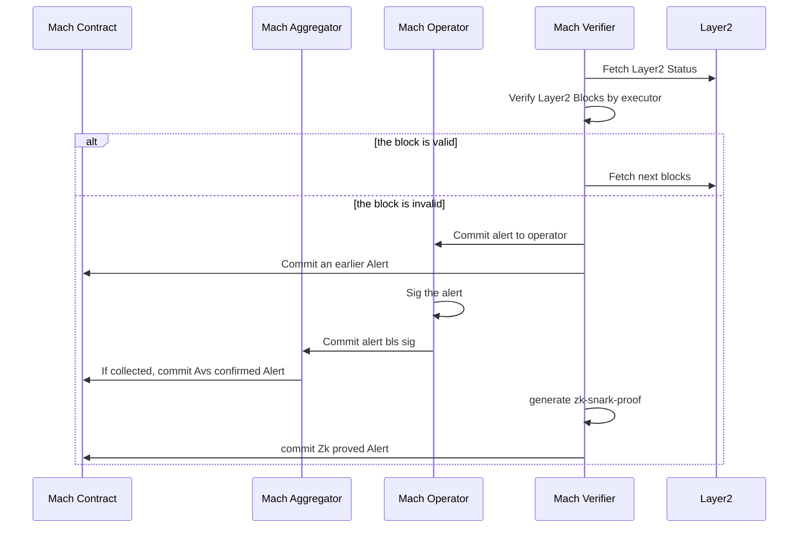
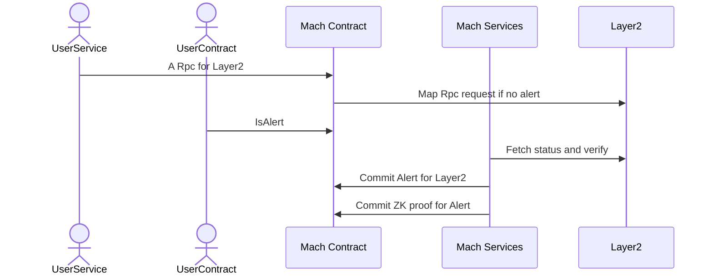

# Mach AVS (M2)

AltLayer Mach AVS is a fast finality layer for Ethereum rollups. In Mach AVS , operators will run verifier nodes for rollups, monitor the rollup for fraudulent behavior, and submit a fraudulent alert to Mach AVS. Fraudulent alert can then be confirmed via sufficient quorum or ZK proofs.

## Use cases

1. Fast finality services for Web3 application
2. Circuit breaker for RPC nodes

## Deployments

| Name                          | Network | Details                                                                                              |
| ----------------------------- | ------- | ---------------------------------------------------------------------------------------------------- |
| AltLayer                      | Mainnet | [View Details](docs/avs-details/mainnet/altlayer.md)                                                 |
| Xterio                        | Mainnet | [View Details](docs/avs-details/mainnet/xterio.md)                                                   |
| DODOchain                     | Mainnet | [View Details](docs/avs-details/mainnet/dodochain.md)                                                |
| Cyber                         | Mainnet | [View Details](docs/avs-details/mainnet/cyber.md)                                                    |
| GM Network                    | Mainnet | [View Details](docs/avs-details/mainnet/gm-network.md)                                               |
| Soneium                       | Mainnet | [View Details](docs/avs-details/mainnet/soneium.md)                                                  |
| MACH Service Manager Registry | Mainnet | [View on Etherscan](https://etherscan.io/address/0x289dbe6573d6a1daf00110b5b1b2d8f0a34099c2)         |
| AltLayer                      | Holesky | [View Details](docs/avs-details/holesky/altlayer.md)                                                 |
| MACH Service Manager Registry | Holesky | [View on Etherscan](https://holesky.etherscan.io/address/0x5c36928d11d7a39641ed520d2213afc9ec806d71) |

#### Rollup Chain IDs

- AltLayer:
  - `11155420` OP sep
  - `421614` Arb sep
- Xterio: `1637450`

## Upgrade

### 0. Check storage collision

Check if storage collision is possible by running the following command:

```sh
make storage-report
```

This will generate a report in the `storage-report` folder. Review the report to ensure there are no storage collisions before proceeding with the upgrade.

### 1. Deploy New Implementation Contracts

Make sure your `proxies.json` file contains all the necessary addresses:

```json
{
  "AVS_DIRECTORY": "0x...",
  "REGISTRY_COORDINATOR": "0x...",
  "STAKE_REGISTRY": "0x...",
  "REWARDS_COORDINATOR": "0x...",
  "BLS_SIGNATURE_CHECKER": "0x...",
  "DELEGATION_MANAGER": "0x...",
  "MACH_SERVICE_MANAGER": "0x...",
  "APK_REGISTRY": "0x...",
  "INDEX_REGISTRY": "0x..."
}
```

You can deploy all the new implementation contracts at once using the `MachServiceManagerImplDeployer` script:

```sh
# Set environment variables
export PK="your-private-key"
export URL="your-rpc-url"
export API_KEY="your-etherscan-api-key"

forge script script/MachServiceManagerImplDeployer.s.sol \
     --private-key $PK \
     --rpc-url $URL \
     --etherscan-api-key $API_KEY \
     --broadcast -vvvv --slow --verify | tee MachServiceManagerImplDeployer.log
```

This script will deploy the new implementation contracts and verify them on Etherscan. Make sure to replace `your-private-key`, `your-rpc-url`, and `your-etherscan-api-key` with your actual values.

The script will deploy all implementation contracts and output their addresses in the console.

### 2. Upgrade Proxy Contracts

For each contract, call `upgradeAndCall` function on the ProxyAdmin to point to the new implementations.

```sh
# Example for upgrade without initialization:
cast calldata --rpc-url $RPC_URL --private-key $PRIVATE_KEY 0xYourProxyAdmin "upgradeAndCall(address,address,bytes)" 0xYourProxy 0xYourNewImplementation 0x
```

#### Upgrade the following contracts in this order:

1. RegistryCoordinator
2. BLSApkRegistry
3. StakeRegistry
4. IndexRegistry
5. MachServiceManager

### 3. Verify Upgrades

To find the implementation address behind the proxy:

```sh
cast storage 0xYourProxy 0x360894a13ba1a3210667c828492db98dca3e2076cc3735a920a3ca505d382bbc --rpc-url $RPC_URL
```

This is determined by the keccak-256 hash of "eip1967.proxy.implementation" subtracted by 1.

To find the proxy admin address:

```sh
cast storage 0xYourProxy 0xb53127684a568b3173ae13b9f8a6016e243e63b6e8ee1178d6a717850b5d6103 --rpc-url $RPC_URL
```

This is determined by the keccak-256 hash of "eip1967.proxy.admin" subtracted by 1.

## Audits

- [PeckShield-Audit-Report-AltLayer-MACH-AVS-v1.0.pdf](audits/PeckShield-Audit-Report-AltLayer-MACH-AVS-v1.0.pdf)
- [AltLayer-Mach-AVS-M2-Final-by-n-var.pdf](audits/AltLayer-Mach-AVS-M2-Final-by-n-var.pdf)

## Components

Mach AVS consists of the following component:

- Mach AVS service manager contract
- Mach AVS aggregator (for signature aggregation version)
- Mach AVS operator
- Mach verifier

## Architecture



### BLS Signature Aggregation Mode

.png>)


```mermaid
sequenceDiagram
    participant MC as Mach Contract

    participant MA as Mach Aggregator
    participant MO as Mach Operator

    participant MV as Mach Verifier

    participant L2 as Layer2

    MV ->> L2: Fetch Layer2 Status
    MV ->> MV: Verify Layer2 Blocks by executor

    alt the block is valid
    MV ->> L2: Fetch next blocks
    else the block is invalid
    MV ->> MO: Commit alert to operator
    MV ->> MC: Commit an earlier Alert
    MO ->> MO: Sig the alert
    MO ->> MA: Commit alert bls sig
    MA ->> MC: If collected, commit Avs confirmed Alert
    MV ->> MV: generate zk-snark-proof
    MV ->> MC: commit Zk proved Alert
    end
```

### ZK Proof Mode

.jpg>)


```mermaid
sequenceDiagram
    actor US as UserService
    actor UC as UserContract
    participant MC as Mach Contract
    participant MS as Mach Services
    participant L2 as Layer2


    US->>MC: A Rpc for Layer2

    MC->>L2: Map Rpc request if no alert

    UC->>MC: IsAlert

    MS->>L2: Fetch status and verify

    MS->>MC: Commit Alert for Layer2
    MS->>MC: Commit ZK proof for Alert
```

## Mach AVS service manager contract

Mach AVS service manager contracts can be found in [contracts folder](contracts/src/core/)

- [Mach AVS for all rollup stack (BLS Signature aggregation)](contracts/src/core/MachServiceManager.sol)
- [Mach AVS for OP stack based rollup (ZK proof)](contracts/src/core/MachOptimismZkServiceManager.sol)

### Dependencies

Mach AVS uses [EigenLayer Middleware v0.1.2](https://github.com/Layr-Labs/eigenlayer-middleware/releases/tag/v0.1.2-holesky-init-deployment)

### Alert submission and verification

#### BLS Signature Aggregation Mode

The aggregator service will collect BLS signatures from operators in Mach AVS. Upon reaching sufficient threshold,
the aggregator will `confirmAlert)` to submit the alert. Once verified, the alert will be confirmed.

#### ZK Proof Mode

In this mode, it does not need an aggregator to collect signatures. ZK Proof will replace the process of collecting BLS signature.

Operator can detect block or output root mismatch and submit an alert using `alertBlockMismatch()` and `alertBlockOutputOracleMismatch(`) respectively.
After the alert is submitted, operator will compute the corresponding ZK proof to prove the alert and submit the proof using `submitProve()`.

ZK Proof generation can be either done using RISC0 or GPU.

### Training wheels

Mach AVS includes operator allowlist which can be managed by contract owner.

#### Enable/Disable operator allowlist

- Enable operator allowlist: `enableAllowlist()`
- Diosable operator allowlist: `disableAllowlist()`

#### Operator allowlist management

- Add operator to whitelist: `addToAllowlist(address operator)`
- Remove operator from whitelist: `removeFromAllowlist(address operator)`

## Mach AVS Aggregator (for BLS Signature Mode)

Aggregator sample configuration file can be found at [config-files/aggregator.yaml](config-files/aggregator.yaml).

```bash
./bin/mach-aggregator --config <PATH_TO_CONFIG> \
    --ecdsa-private-key <OWNER_PRIVATE> \
    --avs-deployment ./contracts/script/output/machavs_deploy_output.json
```

The `--avs-deployment` is use the `machavs_deploy_output.json` output by deploy script.

Mach AVS aggregator service can be found in [aggregator](aggregator/)

## Mach AVS Operator (for BLS Signature Aggregation Mode)

Operator sample configuration file can be found at [config-files/operator.yaml](config-files/operator.yaml).

Operator can be run using the following command:

```bash
./bin/mach-operator-signer --config <PATH_TO_CONFIG>
```

Node operator client can be found in [operator](operator/). For more information on how to run operator, check out our guide at [here](scripts/README.md)

## Mach AVS Verifier

### Verifier for ZK Proof mode

The ZK Proof mode verifier codebase is found at [https://github.com/alt-research/alt-mach-verifier](https://github.com/alt-research/alt-mach-verifier)

### Verifier for BLS Signature Aggregation mode

The verifier codebase is found at [https://github.com/alt-research/mach](https://github.com/alt-research/mach)

## Deployment scripts for running within local devnet

Check out [scripts](scripts)

## Build a devnet by docker-compose

For devnet, we can use docker-compose:

```bash
docker compose build
docker compose up
```

it will boot anvil as layer1, an aggregator and a operator for test.

## Build and Run

If want to run Mach AVS by binary, can see the documentations:

- [build operator and aggregator](./docs/Build.md)
- [run operator](./docs/RunOperator.md)
- [run aggregator](./docs/RunAggregator.md)
